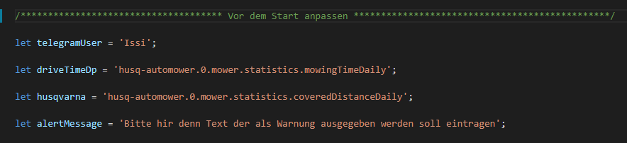

# Husqvarna Mähroboter Messerwechsel Warnung

 * unter **telegramUser** kommt der Telegramm User Name, an dem die Warnung geschickt werden soll.
 * bei **driveTimeDp** kommt die id von dem Datenpunkt für die Fahrzeit für Heute rein.
 * unter **husqvarna** kommt die id von dem Datenpunkt vom Husqvarna Mähroboter wo die gefahrenen Meter für den Tag eingetragen sind.  
 * unter **alertMessage** könnt ihr euren eigenen Text für die Warnung angeben. 

Weiter unten wird nichts mehr verändert.

### Unter **(0_userdata.0.husqvarna)** werden 7 Datenpunkte erstellt.

1.  **changing_knife** => zeigt an das die Messer gewechselt werden müssen.
2.  **drive_time** => zeigt die Zeit, die der Mähroboter heute gefahren ist.
3.  **driving_route** => zeigt die Fahrstrecke in km, die der Mähroboter heute gefahren ist.
4.  **knife_changed** => Mit diesem button resetet man die Wechsel Meldung und die km. 
5.  **rest_range** => zeigt die restlichen km bis zum Wechsel.
6.  **telegram_changing_message** => hier kann man die Telegramm Nachricht ein und ausschalten **standardmäßig ist sie ausgeschaltet. **
7.  **warning_limit** => hier werden die km eingestellt bei den die Warnung ausgegeben werden soll.

## Changelog
### 0.1.0 (2020-04-06)
* (xXBJXx) README.md angepasst
### 0.0.5 (2020-03-27)
* (xXBJXx) Rest range berechnung und beschreibung geändert  
### 0.0.1 (2020-03-27)
* (xXBJXx) Script Erstellt und hochgeladen 
